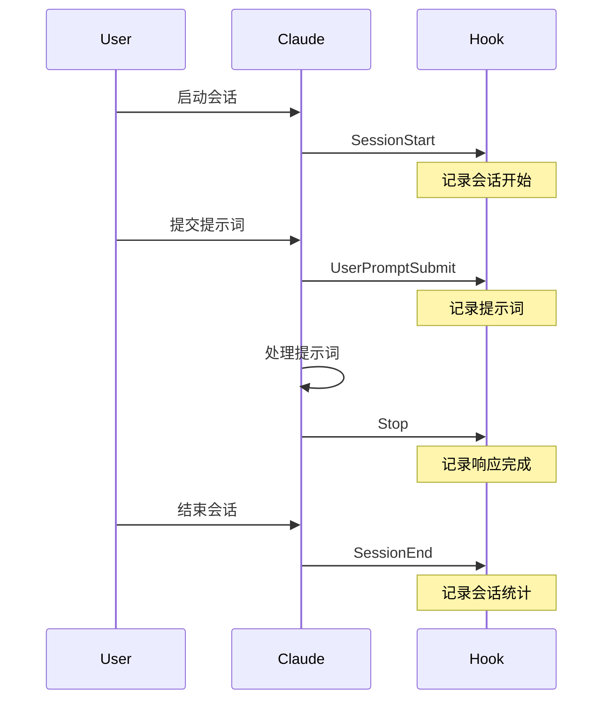

# Claude Code Hooks 配置 - 最终总结

## ✅ 验证完成

**测试结果**: 4/4 通过 ✅

```
============================================================
测试总结: 4 通过, 0 失败
============================================================
[OK] 所有测试通过！
```

## 📁 完整文件结构

```
AISafeOS64/
├── .claude/
│   ├── hooks/
│   │   ├── session_start.py          # ✅ 会话开始 Hook
│   │   ├── user_prompt_submit.py     # ✅ 提示词记录 Hook
│   │   ├── stop.py                   # ✅ 响应完成 Hook
│   │   ├── session_end.py            # ✅ 会话结束 Hook
│   │   ├── test_hooks.py             # ✅ Hook 测试脚本
│   │   ├── log-prompt.py             # ⚠️  旧版本（已废弃）
│   │   ├── log-response.py           # ⚠️  旧版本（已废弃）
│   │   ├── import_history.py         # ✅ 历史导入工具
│   │   ├── analyze_prompts.py        # ✅ 统计分析工具
│   │   └── README.md                 # ✅ 详细文档
│   └── settings.local.json           # ✅ Hook 配置
│
└── prompt/
    ├── prompt.md                     # ✅ 提示词日志（自动生成）
    ├── sessions.md                   # ✅ 会话日志（自动生成）
    ├── QUICKSTART.md                 # ✅ 快速指南
    ├── SUMMARY.md                    # ✅ 实施总结
    ├── HOOKS_GUIDE.md                # ✅ Hooks 配置指南（修正版）
    └── 20260112-*.txt                # ✅ 单独备份文件（自动生成）
```

## 🔧 配置文件

### settings.local.json

```json
{
  "permissions": {
    "allow": [
      "Bash(wc:*)",
      "Bash(tree:*)",
      "Bash(./scripts/git_push.sh:*)",
      "Bash(dir:*)",
      "Bash(find:*)",
      "Bash(for:*)",
      "Bash(do if [ -f \"$f\" ])",
      "Bash(fi:*)",
      "Bash(python:*)"
    ]
  },
  "hooks": {
    "SessionStart": "python .claude/hooks/session_start.py",
    "UserPromptSubmit": "python .claude/hooks/user_prompt_submit.py",
    "Stop": "python .claude/hooks/stop.py",
    "SessionEnd": "python .claude/hooks/session_end.py"
  }
}
```

## 🎯 已修正的关键问题

### 问题 1: 事件名称格式

| 项目 | 错误 | 正确 |
|------|------|------|
| 事件名称 | `user-prompt-submit` | `UserPromptSubmit` |
| 命名风格 | kebab-case | CamelCase |

### 问题 2: 数据传递方式

| 项目 | 错误实现 | 正确实现 |
|------|----------|----------|
| 数据来源 | 环境变量 | stdin (JSON) |
| 读取方式 | `os.getenv()` | `json.loads(sys.stdin.read())` |

**正确示例**:
```python
import sys
import json

# 从 stdin 读取 JSON 数据
input_data = json.loads(sys.stdin.read())
prompt_content = input_data.get('prompt', '')
```

### 问题 3: 脚本返回值

| 项目 | 错误 | 正确 |
|------|------|------|
| 输出方式 | 打印到 stdout | 返回 None 或 JSON |
| 控制行为 | 无法控制 | 可返回响应对象 |

**正确示例**:
```python
def handle_hook(event_data):
    # 记录数据...

    # 不需要修改行为
    return None

    # 或需要修改行为
    # return {"allow": True}
```

## 📊 Hook 数据流



## 🚀 使用方式

### 1. 自动记录（已配置）

当你在 Claude Code 中工作时：
- ✅ 会话开始自动记录到 `prompt/sessions.md`
- ✅ 提示词自动记录到 `prompt/prompt.md`
- ✅ 响应完成自动追加工具使用记录
- ✅ 会话结束自动记录统计信息

### 2. 手动测试

```bash
# 测试所有 Hooks
python .claude/hooks/test_hooks.py

# 查看生成的日志
tail -n 50 prompt/prompt.md
cat prompt/sessions.md
```

### 3. 导入历史

```bash
# 导入所有历史提示词
python .claude/hooks/import_history.py --all

# 导入单个文件
python .claude/hooks/import_history.py prompt/2026-01-08-64arm64.txt
```

### 4. 统计分析

```bash
# 生成统计报告
python .claude/hooks/analyze_prompts.py

# 导出为 JSON
python .claude/hooks/analyze_prompts.py --export-json
```

## 📝 生成的记录格式

### prompt/prompt.md

```markdown
---
## 提示词记录 #20260112-104431

**时间**: 2026-01-12 10:44:31
**会话ID**: test-session-123
**模型**: claude-sonnet-4.5
**工作目录**: `D:\AI\homework\ClaudeCode\AISafeOS64`

### 用户提示词

```
如何实现信号量？
```

### 上下文文件

- `src/kernel/sync/semaphore.c` (行: 1-100)
- `include/kernel/sync.h`

### 会话元数据

```json
{
  "session_id": "test-session-123",
  "timestamp": "2026-01-12 10:44:31",
  "model": "claude-sonnet-4.5",
  "working_dir": "D:\\AI\\homework\\ClaudeCode\\AISafeOS64",
  "context_file_count": 2
}
```

---

### AI 响应

**完成时间**: 2026-01-12 10:44:31
**使用工具**: Read, Edit

---
```

### prompt/sessions.md

```markdown
---
## 会话开始 - 20260112-103000

**时间**: 2026-01-12 10:30:00
**会话ID**: session-abc123
**会话类型**: 新会话
**模型**: claude-sonnet-4.5
**工作目录**: `D:\AI\homework\ClaudeCode\AISafeOS64`

---

### 会话结束

**结束时间**: 2026-01-12 11:00:00
**持续时间**: 30m 0s
**提示词数量**: 5
**工具调用次数**: 12

---
```

## 🔍 故障排查

### Hook 未触发

**检查清单**:
1. ✅ 事件名称是否为驼峰命名（`UserPromptSubmit`）
2. ✅ 脚本路径是否正确（`.claude/hooks/user_prompt_submit.py`）
3. ✅ Python 是否在系统 PATH 中
4. ✅ 脚本是否有执行权限

**验证命令**:
```bash
# 检查配置
cat .claude/settings.local.json | grep -A 10 hooks

# 测试脚本
python .claude/hooks/test_hooks.py

# 手动运行
echo '{"prompt":"test"}' | python .claude/hooks/user_prompt_submit.py
```

### 脚本执行失败

**常见问题**:
1. ❌ JSON 解析错误 → 确保 stdin 输入是有效 JSON
2. ❌ 变量未定义 → 检查所有变量是否已定义
3. ❌ 文件权限问题 → 确保可写 `prompt/` 目录

**调试方法**:
```bash
# 手动运行并查看错误
echo '{"prompt":"test","contextFiles":[]}' | python .claude/hooks/user_prompt_submit.py

# 查看 Python 语法
python -m py_compile .claude/hooks/user_prompt_submit.py
```

## 📚 文档索引

| 文档 | 路径 | 说明 |
|------|------|------|
| **快速指南** | `prompt/QUICKSTART.md` | 快速上手 |
| **Hooks 指南** | `prompt/HOOKS_GUIDE.md` | 修正后的配置指南 |
| **实施总结** | `prompt/SUMMARY.md` | 初版实施总结 |
| **最终总结** | `prompt/FINAL_SUMMARY.md` | 本文件 |
| **详细文档** | `.claude/hooks/README.md` | 完整 API 文档 |

## 🎉 总结

### 已完成的工作

1. ✅ **修正配置**: 使用正确的驼峰命名事件
2. ✅ **修正脚本**: 从 stdin 读取 JSON 数据
3. ✅ **添加 Hooks**: SessionStart, UserPromptSubmit, Stop, SessionEnd
4. ✅ **测试验证**: 所有 Hook 通过测试
5. ✅ **文档完善**: 修正指南和最终总结

### 系统特点

- ✅ **自动化**: 无需手动记录
- ✅ **规范化**: 统一的 Markdown 格式
- ✅ **可追溯**: Git 版本控制友好
- ✅ **可扩展**: 支持添加更多 Hook
- ✅ **跨平台**: 支持 Windows/Linux/macOS

### 下一步行动

1. **正常使用**: 在 Claude Code 中工作，Hooks 会自动记录
2. **定期查看**: 检查 `prompt/prompt.md` 和 `prompt/sessions.md`
3. **可选导入**: 运行 `import_history.py --all` 导入历史
4. **定期统计**: 运行 `analyze_prompts.py` 查看统计

---

**配置完成时间**: 2026-01-12
**版本**: v2.0 (修正版)
**状态**: ✅ 所有测试通过，系统就绪
